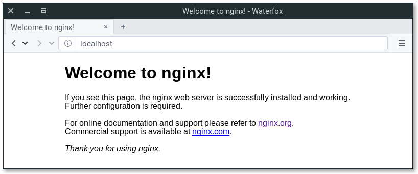

### /var/www/html/web


Installing Nginx
- sudo apt update
- sudo apt install nginx


After installing it, you already have everything you need.



Creating our own website

Default page is placed in /var/www/html/ location. 
You can place your static pages here, or use virtual host and place it other location.


Configure 

- ssh -i "camo.pem" ubuntu@ec2-54-173-9-169.compute-1.amazonaws.com
- cd /etc/nginx/sites-enabled
- sudo vim camo
- sudo vim default

```commandline
server {
       listen 80;
       listen [::]:80;

       server_name example.ubuntu.com;

       root /var/www/;
       index index.html;

       location / {
               try_files $uri $uri/ =404;
       }
}
```

- root is a directory where we have placed our .html file. 
- index is used to specify file available when visiting root directory of site. 
- server_name can be anything you want

Activating virtual host and testing results
```commandline
sudo service nginx restart
```


